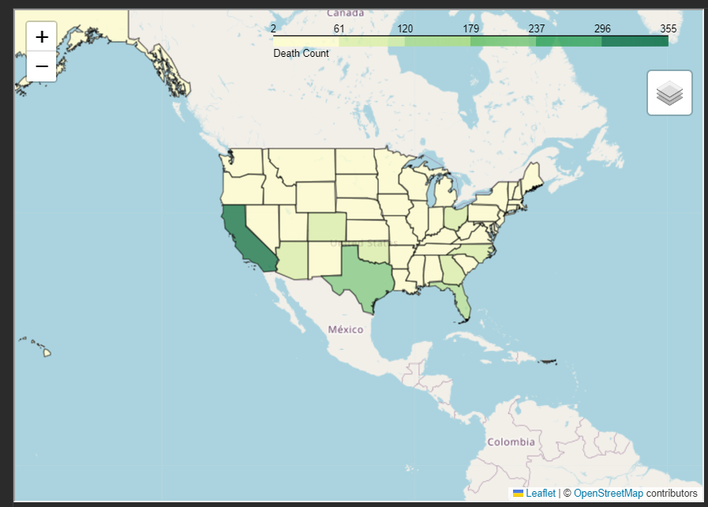
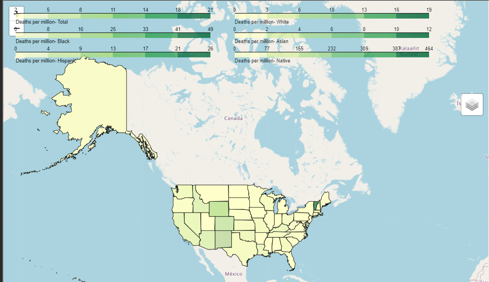

# **Fatal Police Shootings**
*author: Celine Ng*  
*March 2024*

## Objective 
Analyze fatal police shootings throughout the United States of America. 
1. Police action against victims with mental illness 
2. Race inequality - Native racial group with unusually high standard 
deviation for fatality per million
3. Race inequality - Black racial group has the highest fatality per 
   million  

## Data Source
1. [Main dataset](https://www.kaggle.com/datasets/washingtonpost/police-shootings)
2. [US racial population](https://www.census.gov/quickfacts/fact/table/US#)
3. [US racial population by state and city](https://www.census.gov/data/tables/2023/dec/2020-census-dhc.html)  
2020 Census DHC 
P5 -> race population by state

## Approach & Methodology
This project follows a structured approach including data cleaning, data 
exploration, and correlation analysis.
1. Data cleaning: Check and visualize missing values (compare distribution 
   before/after imputation), duplicates, inadequate datatypes, and 
   outliers.
2. Data exploration: 
 - Visualize on GeoPandas deaths scaled by racial 
   population of the whole country, as the graph shows, the racial group 
   "black" has the highest fatality per population (at least 2x more than 
   other groups). While "asian" has the lowest. T
- Then visualized 
   deaths scaled by racial population by state, where is was understood 
   that New Mexico, Oklahoma, Alaska, District of Columbia and West 
   Virginia has the highest fatality rate by state population. It was 
  also found that native americans had an unusually high standard deviation 
  of fatality, otherwise "native american" has a median of 0 fatalities 
  per million, while "Black" has the highest median of 12.7 per million.
3. Correlation Analysis: Attempt to understand the unusual high fatality 
   rate for native american group, and whether the high fatality rate in 
   black racial group is correlated with any of the present behavioural 
   features.

## Results
1. Police officers tend not to shoot people with mental health issues. 
2. Fatality in Vermont for the native racial group could be random or due to
 its small population, as there was actually only one fatal case.
3. The black racial group tend to flee more and knowing that fleeing is an 
important factor in fatality, it could explain a higher fatality rate. However,
 it is not enough to explain the different fatality rates between the racial 
 groups. There is indeed a racial inequality against the black racial group.
    

**Further Suggestions:** 
Body camera usage should be encouraged, even when it is not correlated with 
fatality. It could be used to prevent false claims of attacks from police 
officers.  

## Screenshot of Fatality Rate on map
&emsp;Death by State and City 
 
&emsp; Scaled Fatalities (state & race) 
  

