# **Fatal Police Shootings**
*author: Celine Ng*  
*March 2024*

## Project Summary 
Analyze fatal police shootings throughout the United States of America. 
1. Police action against victims with mental illness 
2. Race inequality - Native racial group with unusually high standard 
deviation for fatality per million
3. Race inequality - Black racial group has the highest fatality per 
   million  

Conclusion: 
1. Police officers tend not to shoot people with mental health issues. 
2. Fatality in Vermont for the native racial group could be random or due to
 its small population, as there was actually only one fatal case.
3. The black racial group tend to flee more and knowing that fleeing is an 
important factor in fatality, it could explain a higher fatality rate. however,
 it still does not explain the difference in fatality rates of the racial 
 groups. There is indeed a racial inequality against the black racial group.
    

Further Suggestions: 
Body camera usage should be encouraged, even when it is not correlated with 
fatality. It could be used to prevent false claims of attacks from police 
officers.  

## Code Structure
**1. Import Libraries &  Data Retrieval** 
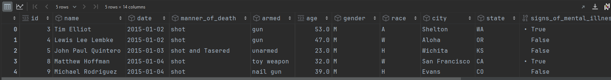  
**2. Quick Exploration & Data Cleaning** 
2.1 Missing values   
Summary:
After locating the missing values, quick visualization and exploration were 
applied to understand which are the best treatments. There are too 
many missing values and rows containing missing values, therefore 
imputation method was used in most cases. For columns "name" and "race", due
to its irrelevance and complication to impute data, missing data are not 
treated.  
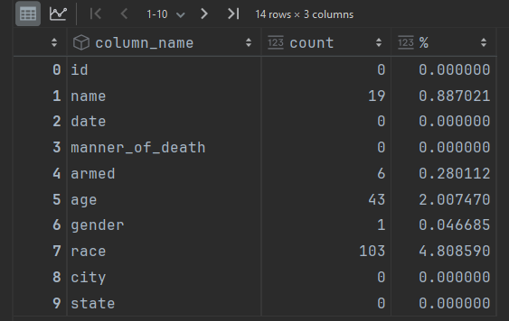 
&emsp; 2.1.1 Imputation  
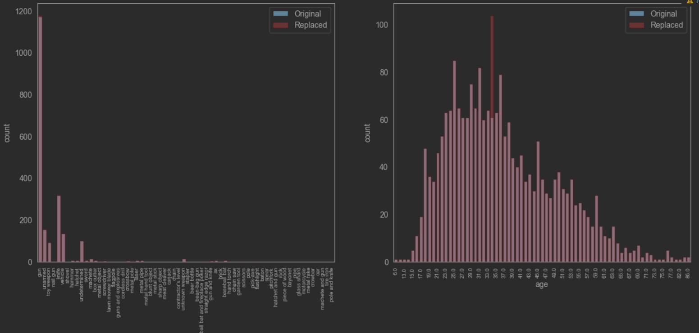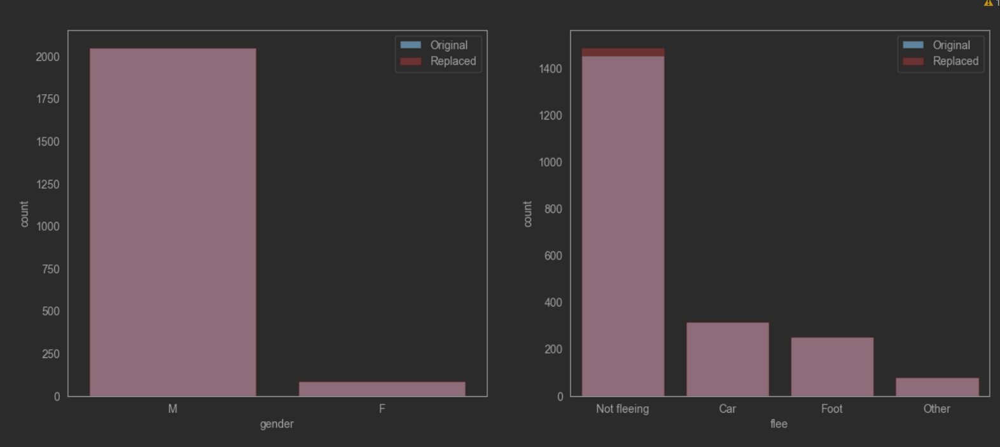  
2.2 Duplicates  
2.3 Inadequate Datatypes  
Summary: Columns *date* and *age* datatypes are changed to datetime64 and 
int64.  
2.4 Outliers/Quick visualization  
&emsp; 2.4.1 Death by Time and Age 
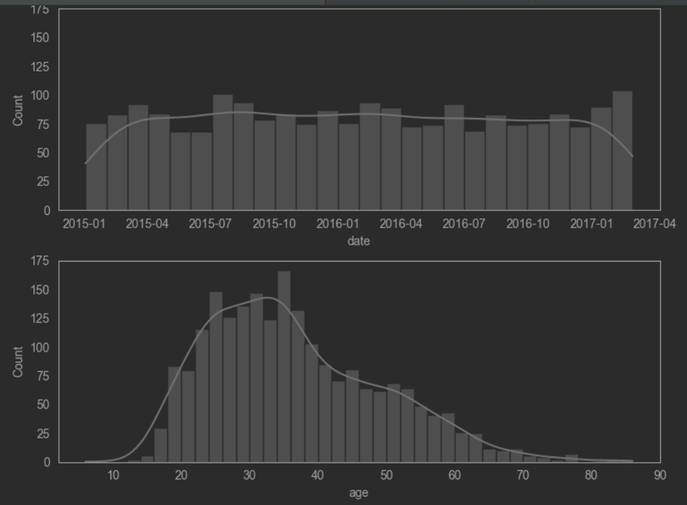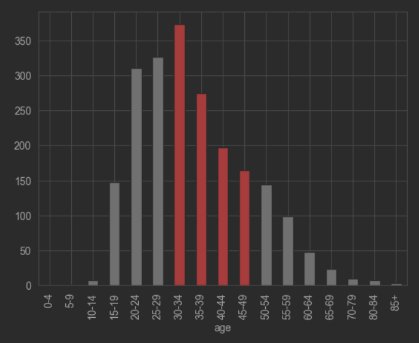  
&emsp; 2.4.2 Death by State and City 
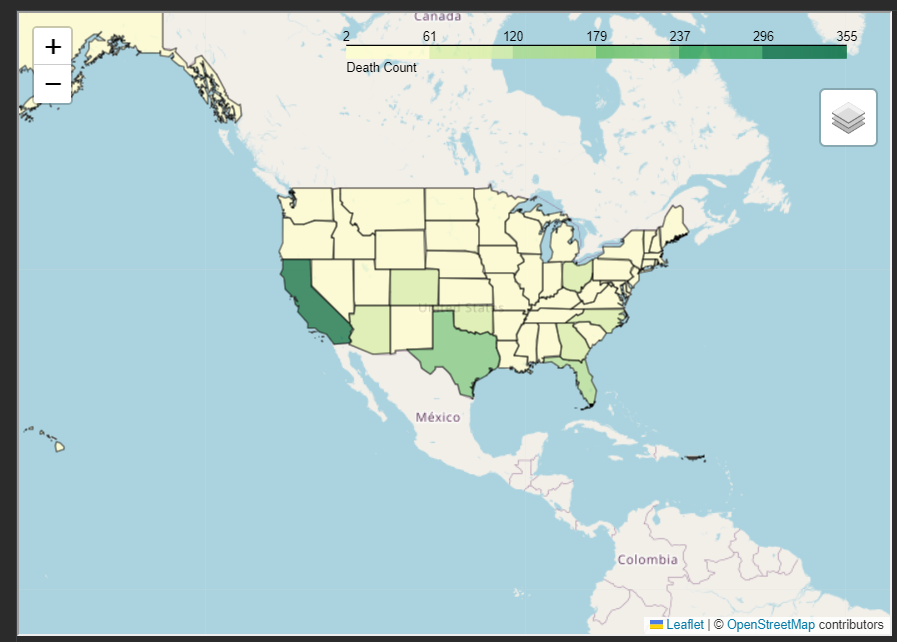 
&emsp; 2.4.3 Death by Categorical Features 
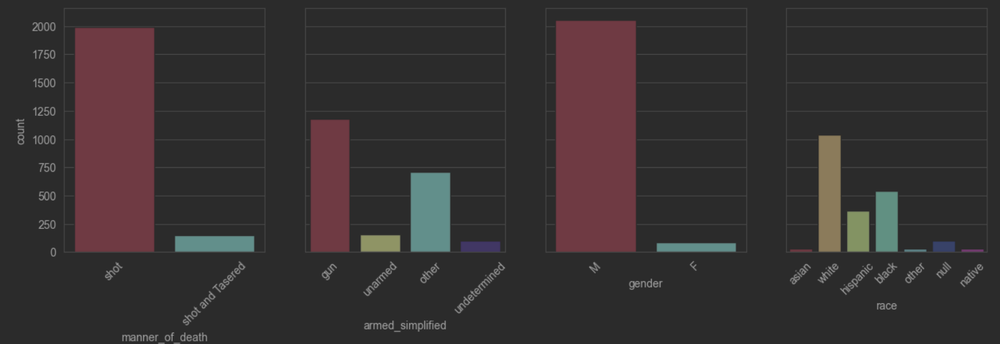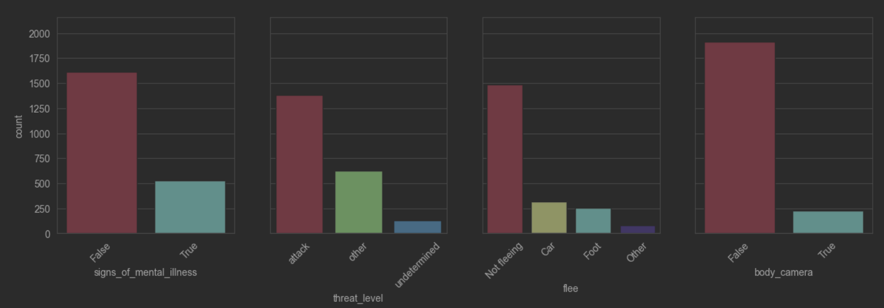  

**3. Data Exploration & Visualization** 
3.1 Visualize Deaths Scaled by Racial Proportions 
Summary: From the previous data visualizations, deaths by race was one of 
the graph with an unclear conclusion. It seemed at first glance that most 
fatalities were grouped "white". However, racial population is uneven in the 
US. Therefore, those number do not mean much without proper scaling. 

After scaling, as the graph shows, the racial group "black" has the highest 
fatality per population (at least 2x more than other groups). While "asian" 
has the lowest. 
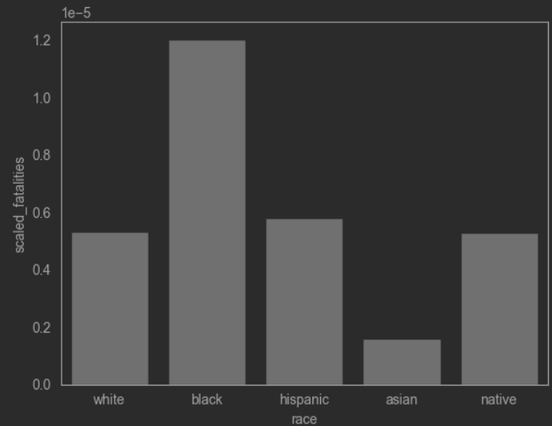 
3.2 Extra Dataset - Population by State & by Race 
Summary: Introduce new dataset from Census 2020 about population and racial 
population in each state in 2020, called *p5*. 
With the new *p5* data, like in 3.1 we are able to scale the police shooting 
fatalities to the population. 
The original data was grouped into state and race. In order to scale the 
number of fatal police shooting cases, the grouped data was then divided by 
the population information gathered from *p5*. 
From the scaled data, fatality per million, it is understood that the states
with the highest fatality rates are New Mexico, Oklahoma, Alaska, District 
of Columbia and West Virginia. This is, however, not consistent when race is 
analyzed separately. 
Also, the native racial group has an unusually high standard deviation. 
&emsp; 3.2.1 Introduce new dataset & Quick Cleaning 
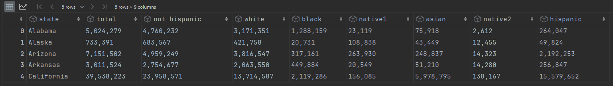 
&emsp; 3.2.2 Scale Fatalities to Population & Quick exploration 
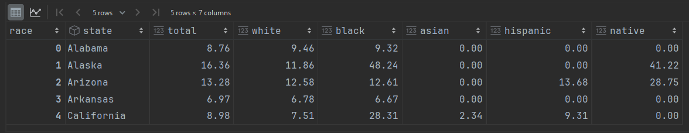 
&emsp; 3.2.3 Visualize Scaled Fatalities (state & race) 
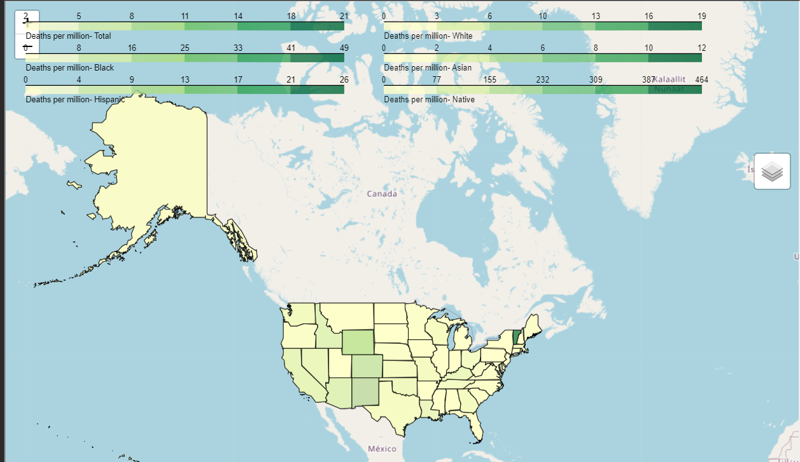  

**4. Correlation Analysis** 
4.1 Race inequality - Native racial group with unusually standard deviation of 
fatality rate. 
Summary: Hypothesis, native american is a relatively small racial 
group, so the fatality rate can be falsely high specially in states with an 
even smaller group of native americans. 

There is no significant Pearson correlation between population and fatality 
rate, therefor the Vermont case may just be random, as it is only one case. 
4.2 Race inequality - Black racial group with the highest fatality per 
million 
Summary: Fatality per million is correlated positively with cases that 
have attacked and cases with guns. It is negatively correlated with cases 
that did not flee and cases with mental illness. 
However, p-value shows that it is only statistically truly correlated with 
cases that did not flee. 

Black racial group has the highest fatality per million and by visualization
 this group shows the least mental illness cases, the most fleeing. However,
  it still does not explain the difference in fatality rates of the racial. 
  There is indeed a racial inequality in the fatality rate. 

&emsp; 4.2.1 Correlation and P-value Check - Pearson 

Police officers tend not to shoot people with mental health issues, people 
that do not flee. However, and armed cases and people that attack should be 
dealt with more caution, as there is a correlation with fatality. 
This could because cases showing mental illness do not tend to flee and 
cases that do not flee do not tend to attack or carry guns. 
It is interesting to see that cases that do not flee tend to be caught on 
camera, different from cases with attack, which brings guns and not caught 
on camera. 
No evidence shown that fatality is correlated with body camera, therefor its
usage should not lower fatality, unless police officers falsely claim 
attacks from the victim when it is not caught on camera. 
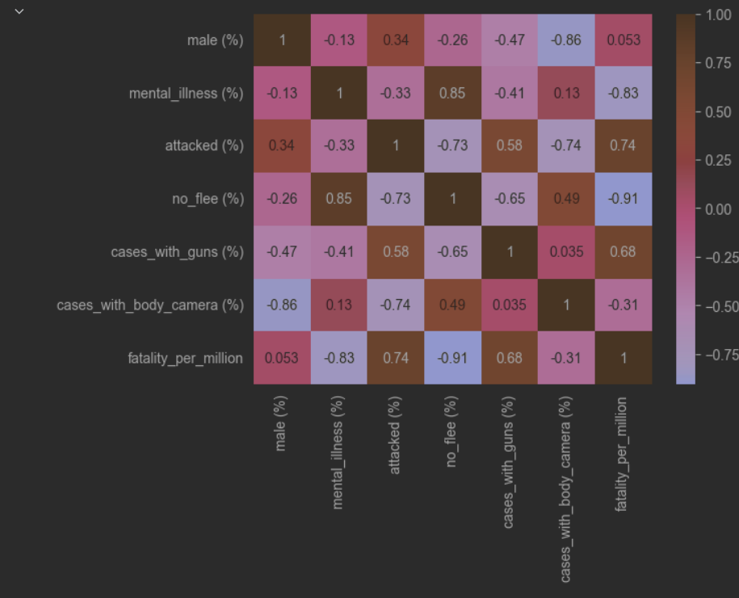  
&emsp; 4.2.2 Racial Group Comparison 
Black racial group has the highest fatality per million and by visualization
 this group shows the least mental illness cases, the most fleeing, and the 
 most or on par with other racial groups in cases with guns and attacks. As 
 for camera, it is on par with other racial groups.  
 This shows that the fatality rate could be heavily affected by fleeing as 
 it is the only factor statistically correlated with fatality rate. However,
  it still does not explain the difference in fatality rates of the racial 
  groups. There is indeed a racial inequality in the fatality rate. 
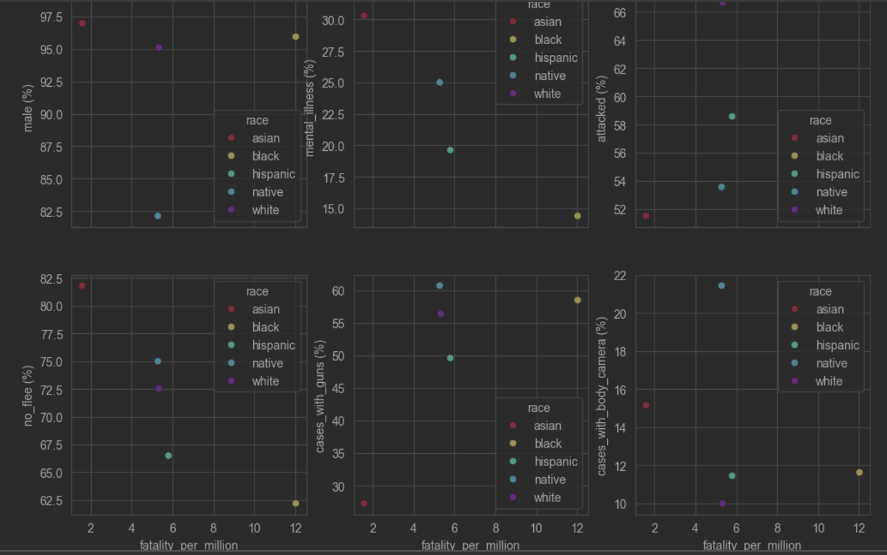  

**Improvements**  
1. Methodology differences may exist between data sources, and so may not be
 comparable. 
2. New datasets are data from Census 2020, not from years 2015-2017, which 
may affect analysis. Also, COVID-19 may have an impact on the data. 

# Extra Data
2020 Census DHC
https://www.census.gov/data/tables/2023/dec/2020-census-dhc.html
P5 -> race population by state

